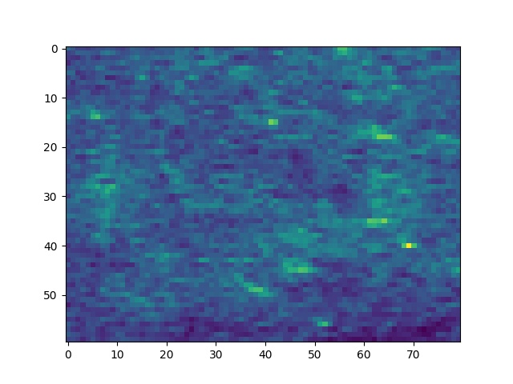
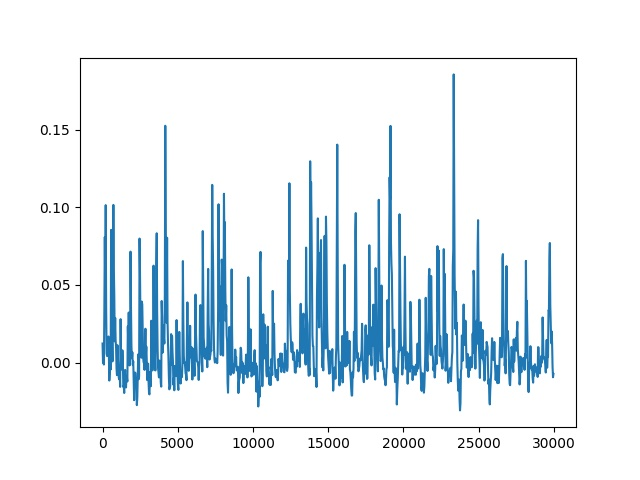
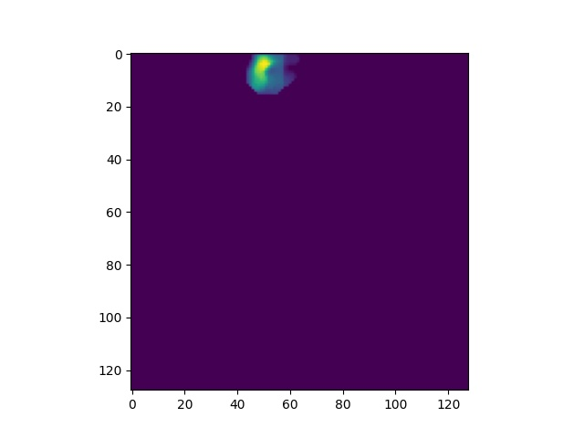

Use Case
========
This will take you though a use case of working with raw image data in TIFF format as well as post processed data using Caiman ROI extraction software.

Download a TIF file and a extract pipeline output .mat file from `here. <https://gin.g-node.org/CatalystNeuro/ophys_testing_data/src/master/segmentation_datasets/>`_

Create an Imaging Extractor Object:
-----------------------------------

.. code-block:: python

    from notebook.services.config import ConfigManager
    cm = ConfigManager().update('notebook', {'limit_output': 1000})
    import roiextractors
    import matplotlib.pyplot as plt
    %matplotlib inline
    import numpy as np
    img_ext = roiextractors.TiffImagingExtractor(r'source\demoMovie.tif' sampling_frequency=100)

.. code-block:: python

    img_ext.get_frames(10)

Output:

.. code-block:: shell

    array([[1050,  676,  652, ..., 1523, 1406, 1627],
       [ 898,  908,  864, ...,  990, 1016, 1058],
       [ 899,  875,  827, ..., 1100, 1122, 1147],
       ...,
       [ 664,  957, 1040, ...,  833,  828, 1075],
       [ 893,  899,  858, ...,  807,  899,  981],
       [ 691,  653,  812, ...,  708,  715,  779]], dtype=uint16)

.. code-block:: python

    img_ext.get_image_size()

Output:

.. code-block:: shell

    [60, 80]

.. code-block:: python

    img_ext.get_num_frames()

Output:

.. code-block:: shell

    2000

.. code-block:: python

    img_ext.get_sampling_frequency()

Output:

.. code-block:: shell

    100.0

.. code-block:: python

    img_ext.get_channel_names()

Output:

.. code-block:: shell

    ['channel_0']

.. code-block:: python

    img_ext.get_num_channels()

Output:

.. code-block:: shell

    1

.. code-block:: python

    vid_fra = img_ext.get_video(start_frame=0,end_frame=1)
    plt.imshow(vid_fra)
    plt.show()

Output:

Create a SegmentationExtractor Object
-------------------------------------

.. code-block:: python

    seg_ext = roiextractors.CaimanSegmentationExtractor(r'source\caiman.hdf5')

.. code-block:: python

    # will output a list of ids of all accepted rois
    seg_ext.get_accepted_list()

Output:

.. code-block:: shell

    [0,1,2,....71]

.. code-block:: python

    seg_ext.get_num_frames()

Output:

.. code-block:: shell

    1000

.. code-block:: python

    seg_ext.get_roi_locations(roi_ids=[2])

Output:

.. code-block:: shell

    array([[ 4],
       [43]])

.. code-block:: python

    plt.plot(seg_ext.get_sampling_frequency()*np.arange(seg_ext.get_num_frames()),seg_ext.get_traces(roi_ids=[2], name='dff').squeeze())
    plt.show()

Output:

.. code-block:: python

    plt.imshow(seg_ext.get_roi_image_masks(roi_ids=[5]).squeeze())
    plt.show()

Output:

.. code-block:: python

    seg_ext.get_image_size()

Output:

.. code-block:: shell

    array([128, 128])

.. code-block:: python

    seg_ext.get_num_rois()

Output:

.. code-block:: shell

    72

